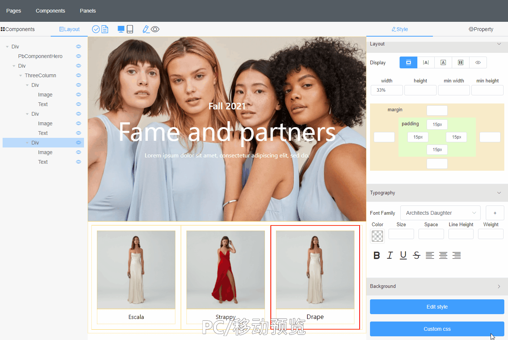
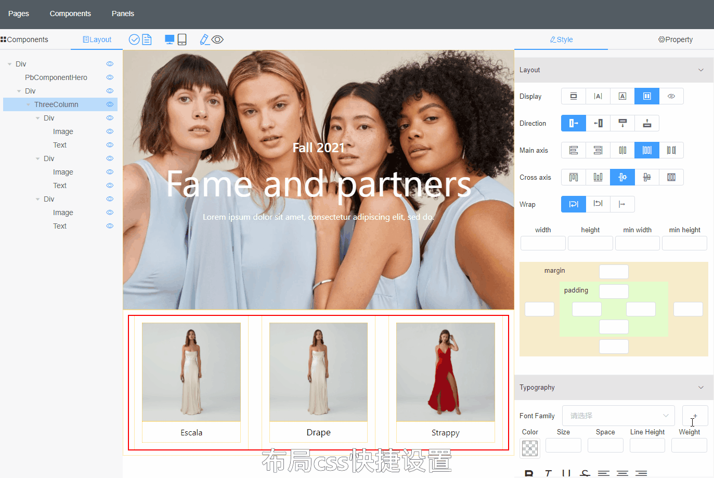
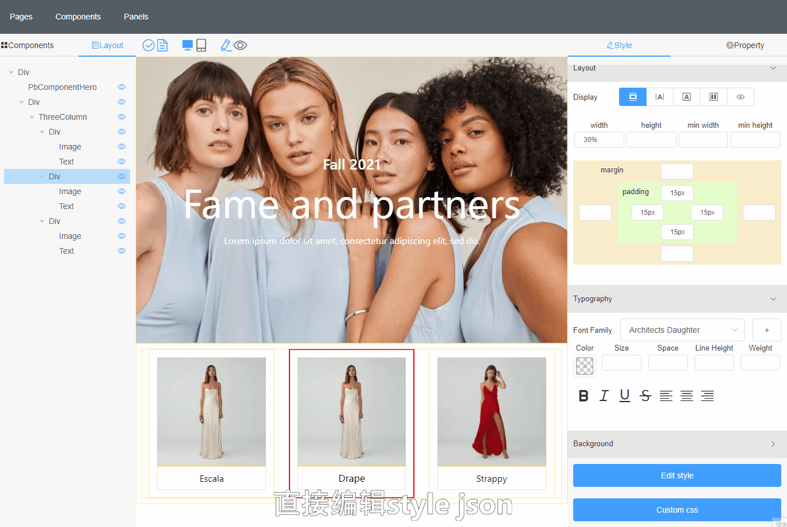
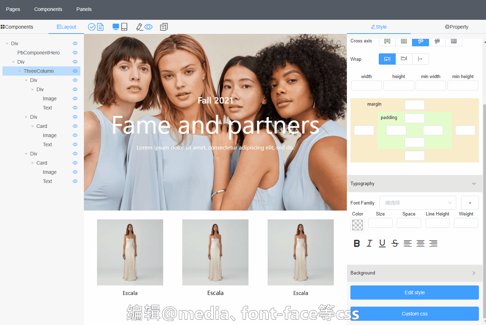
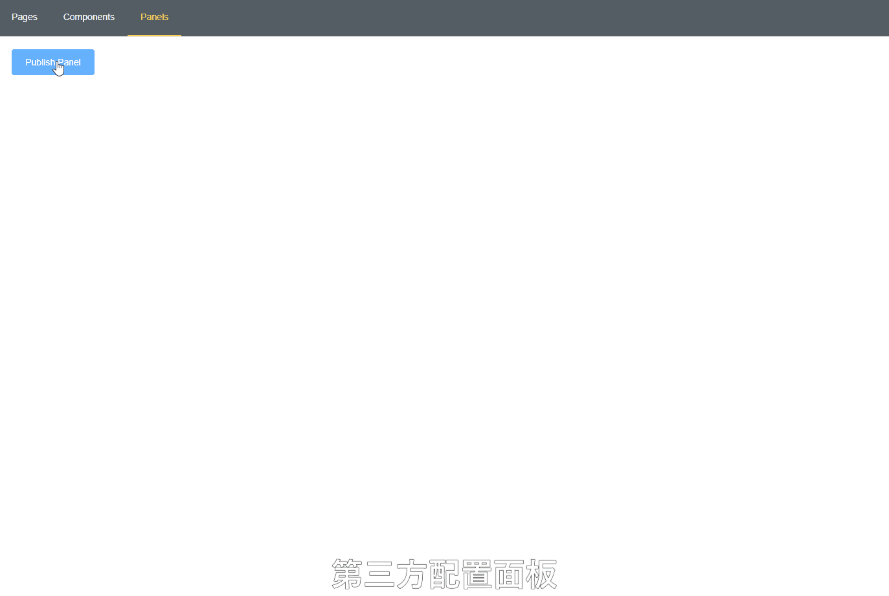
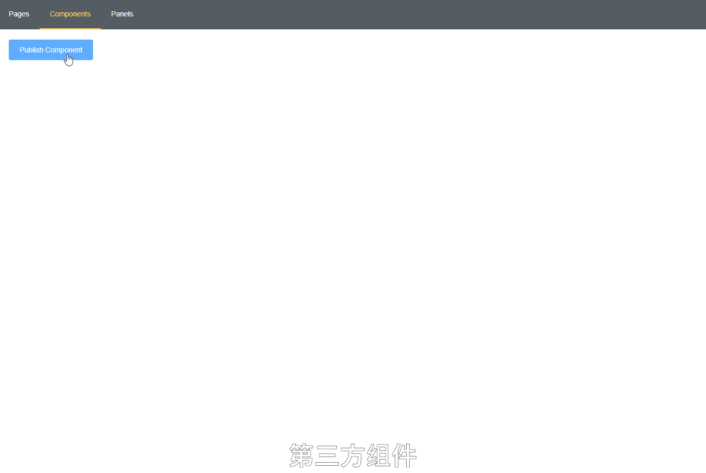
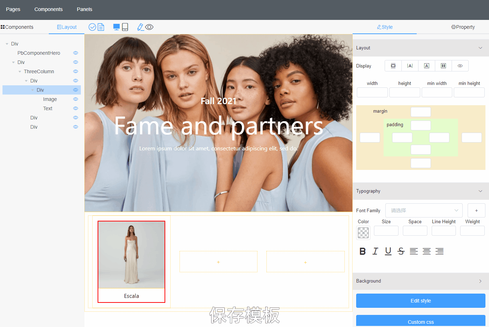
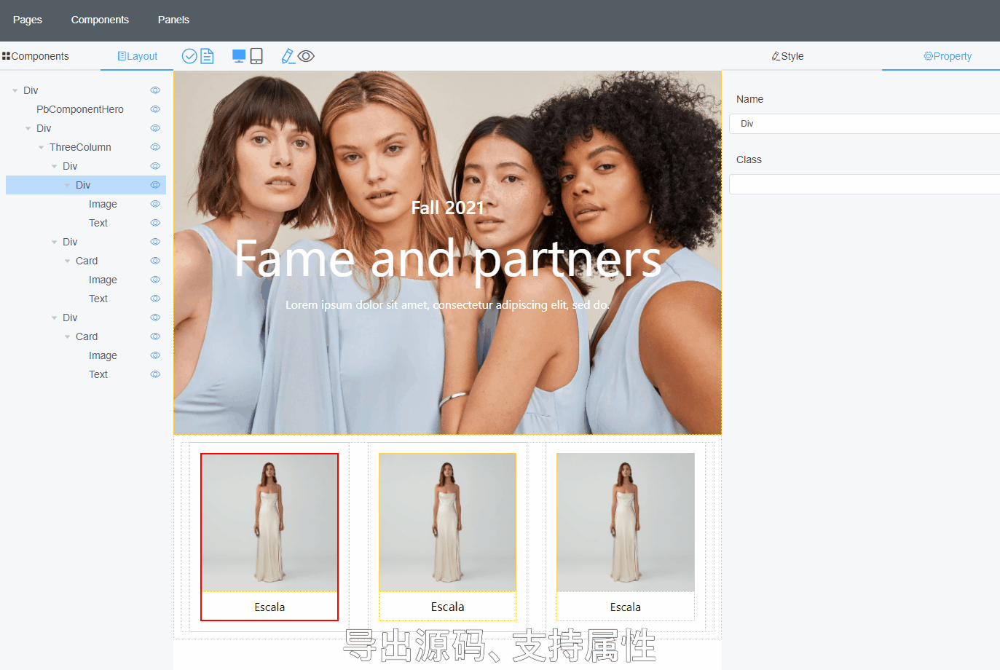
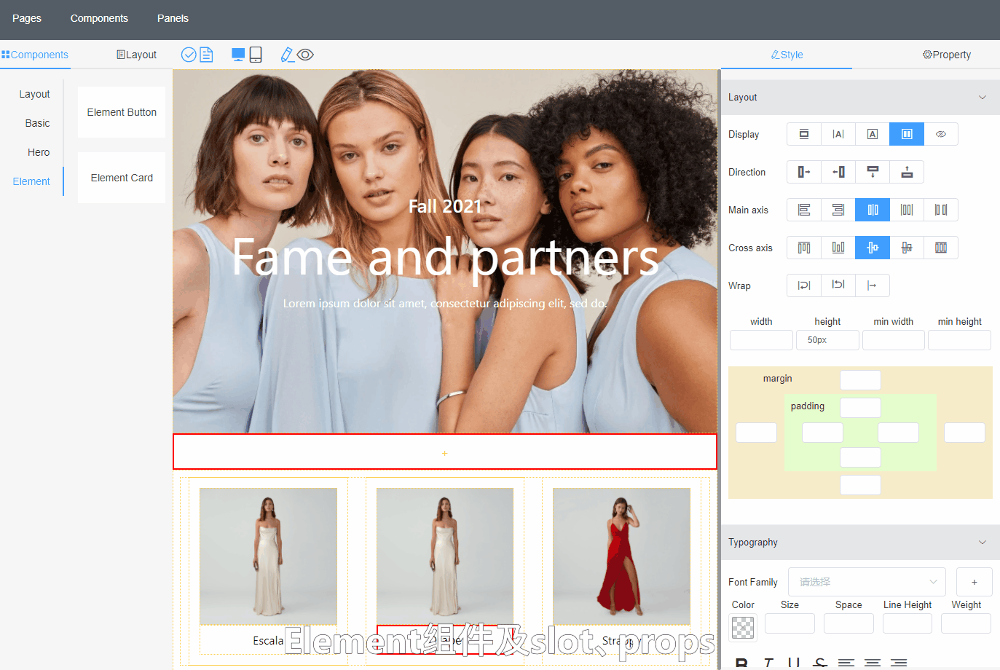
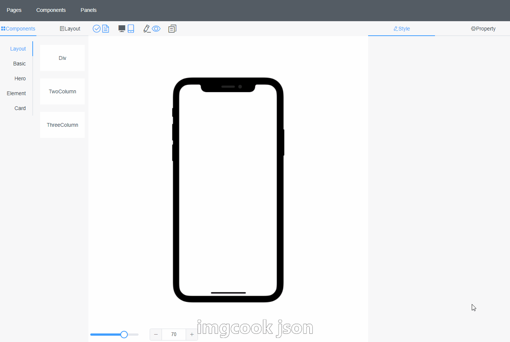

# Page Builder

## 简介
同时为运营人员和开发者服务的拖拽式页面生成器
#### 关键字

页面编辑器、拖拽布局、lowcode、DSL、imgcook、vue3、vite
## DEMO
<https://page-builder.philxu.cn/>
### 主要功能
- 拖拽式布局
- 第三方组件市场，免编译安装到系统使用
- 快捷样式设置
- 第三方样式设置市场，可以使用或自研符合自己需求的快捷配置面板
- 获取html，在cms后台编辑器或营销邮件系统中直接使用
- 生成vue等语言对应vue、css代码，支持props，加快开发效率
- 兼容imgcook schema，ai生成的json可兼容使用
- 其他

### 主要技术栈
- vue3 + vite
- typscript
- midwayjs

### 其他同类产品
阿里的imgcook，侧重于AI识别，生成schemaPage Builder也参考了很多imgcook的交互，Page Builder侧重于页面构建，运营人员可以直接使用生成页面，侧重于活动页，免编译即可使用的第三方组件

## 功能演示

### 拖拽布局
- 页面内拖拽（是否可drop，或左右是否可drop可以配置），有对应放置位置的辅助线
- 从组件库拖入页面，组件库支持分组、预览、第三方组件、模板
- 树状layout展示与拖拽，显示隐藏，删除

  

### 预览模式
- 编辑模式、预览模式切换
- 支持pc、移动预览
- 支持响应式预览（@media）

  

### 样式面板
#### 快捷配置
- 常用快捷布局设置
- flex相关设置
- width/height/margin/padding 快捷设置

  

#### 字体设置
- 设置内置字体
- 上传新字体
- 设置颜色、大小、weight等
- 设置加粗、斜体、下划线等
- 设置对齐方式

  

#### 编辑style json
- 暂未支持面板修改的属性可以通过代码编辑器直接编辑style
- 实时更新效果

  

#### 编辑css
- 对于无法靠style json实现的样式，比如响应式@media query可以通过css编辑器添加
- 实时更新效果

  

#### 第三方面板
- 对于内部需求，可以开发专属配置面板，比如一键设置button样式
- 发布面板供内部或公开安装使用

如下为第三方颜色配置面板
  

### 属性设置
- 设置组件的props
- 支持输入框、Switch开关、下拉选择、图片上传（api地址、数据路径可配置）等属性设置方式

  

### 组件系统

#### 第三方组件
- 发布组件（npm符合要求的组件或在组件模板基础开发的组件）
- 使用组件
- 账户系统完善后支持安装后使用，发布组件提供私有选项

  

#### 模板组件
- 可以将任意结构保存成模板组件，在组件库中使用
- 保留了所有结构，可以继续调整

  

#### 导出组件
- 选择任意结构导出组件代码
- 勾选属性选择组件支持的props，支持重命名
- 生成指定代码（目前支持vue2代码及对应css文件生成），可上传至npm或项目中直接使用

  

#### 包装组件
- 支持包装组件库
- 选择性暴露组件配置

如下包装了element-ui的button，后续添加更多示例
  

### 其他
#### schema json粘贴、编辑
- 支持imgcook生成的schema直接粘贴生成页面

  
#### html 代码导出
- 直接生成html代码，粘贴到其他系统（cms、email等）的html编辑器中

## TODO
- 账户系统
- 更多组件
- 更多内置面板
- 发布组件到npm
- undo、redo
- 复制粘贴